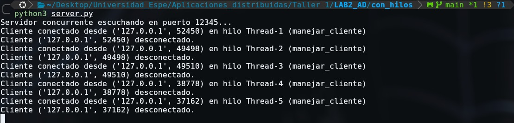

# SistemaDistribuido-Calificaciones

SistemaDistribuido-Calificaciones es una aplicación distribuida en Python para el registro de calificaciones finales de estudiantes. Utiliza **sockets TCP**, archivos **CSV** para persistencia de datos y soporta concurrencia mediante **hilos**. Incluye un servidor adicional de NRC para validar materias antes de registrar calificaciones.

## Características principales
- Servidor de calificaciones con funciones **CRUD**: agregar, buscar, actualizar, listar y eliminar calificaciones.  
- Cliente de consola interactivo que envía comandos y recibe respuestas en **JSON**.  
- Servidor concurrente capaz de atender múltiples clientes simultáneamente.  
- Servidor de NRC independiente para validar materias/NRC antes de registrar o actualizar calificaciones.  
- Persistencia de datos en archivos `calificaciones.csv` y `nrcs.csv`.  
- Manejo de errores y validación de entradas, incluyendo fallos de conexión al servidor de NRC.

## Estructura del proyecto
laboratorio_2/
│
├── README.md
├── calificaciones.csv
├── nrcs.csv
├── sin_hilos/
│ ├── server.py
│ └── client.py
├── con_hilos/
│ ├── server.py
│ └── client.py
└── nrcs_server.py


## Requisitos
- Python 3.8 o superior  
- Sistema operativo compatible con sockets TCP  
- Editor de texto o IDE (VS Code, PyCharm, etc.)

## Despliegue

### 1. Clonar el repositorio
```bash
git clone https://github.com/AxelHerrera4/LAB2_AD
cd SistemaDistribuido-Calificaciones

### 2. Ejecutar el servidor secuencial (sin hilos)

cd sin_hilos
python server.py

### 3. Ejecutar el cliente
python client.py

### 4. Ejecutar el servidor concurrente (con hilos)
cd ../con_hilos
python server.py

Este servidor permite múltiples clientes simultáneamente. Cada cliente se ejecuta en una terminal independiente:

python client.py
Ejecutar el servidor de NRC
python nrcs_server.py


## Parte 2 del laboratorio

### 1. Iniciar el servidor
Ejecuta el servidor (con hilos).  


### Recursos (imágenes)
Las imágenes usadas en este README se encuentran en la carpeta `imagenes/` en la raíz del proyecto. Usa rutas relativas desde la raíz del repositorio para que se muestren correctamente en GitHub y en vistas locales. Ejemplos:

- `imagenes/imagen_servidor.png` — captura para iniciar el servidor concurrente.
- `imagenes/nrcserver.png` — captura del servidor NRC.


