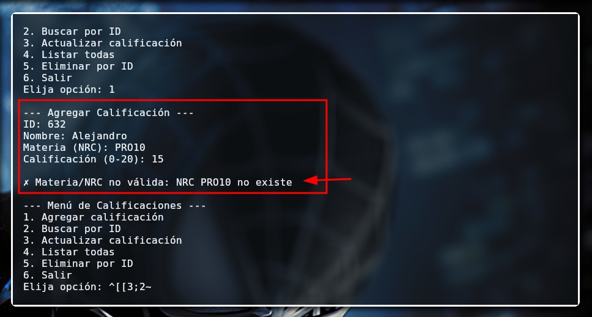

# SistemaDistribuido-Calificaciones


SistemaDistribuido-Calificaciones es una aplicación distribuida en Python para el registro de calificaciones finales de estudiantes. Utiliza **sockets TCP**, archivos **CSV** para persistencia de datos y soporta concurrencia mediante **hilos**. Incluye un servidor adicional de NRC para validar materias antes de registrar calificaciones.

## Introducción

Este proyecto se enmarca en el ámbito de aplicaciones distribuidas, donde múltiples procesos pueden ejecutarse de manera concurrente y comunicarse entre sí. Se implementa un sistema cliente-servidor para el registro de calificaciones de estudiantes, haciendo uso de archivos CSV para la persistencia de datos.

**Conceptos clave:** Concurrencia, Teorema CAP (Consistencia, Disponibilidad, Tolerancia a particiones).

## Objetivos

**General:** Implementar un sistema cliente-servidor con persistencia y validación inter-servidor.

**Específicos:**

* Manejar múltiples clientes simultáneamente.
* Persistencia de datos en CSV.
* Validación de NRC mediante servidor externo.

## Metodología

* **Lenguaje y herramientas:** Python (`socket`, `threading`, `csv`).
* **Diseño modular:** Funciones separadas para conexión de clientes, registro en CSV y validación de NRC.
* **Manejo de fallos:** Reenvío a servidores libres, chequeos de integridad de datos.

**Flujo de operación:**
| Visualizador | Descripción |
|--------------|-------------|
|  |Flujo de operacion  |


## Características principales

* Servidor de calificaciones con funciones **CRUD**: agregar, buscar, actualizar, listar y eliminar calificaciones.
* Cliente de consola interactivo que envía comandos y recibe respuestas en **JSON**.
* Servidor concurrente capaz de atender múltiples clientes simultáneamente.
* Servidor de NRC independiente para validar materias/NRC antes de registrar o actualizar calificaciones.
* Persistencia de datos en archivos `calificaciones.csv` y `nrcs.csv`.
* Manejo de errores y validación de entradas, incluyendo fallos de conexión al servidor de NRC.

## Estructura del proyecto

```
laboratorio_2/
│
├── README.md
├── calificaciones.csv
├── nrcs.csv
├── sin_hilos/
│   ├── server.py
│   └── client.py
├── con_hilos/
│   ├── server.py
│   └── client.py
└── nrcs_server.py
```

## Requisitos

* Python 3.8 o superior
* Sistema operativo compatible con sockets TCP
* Editor de texto o IDE (VS Code, PyCharm, etc.)

## Despliegue

### 1. Clonar el repositorio

```bash
git clone https://github.com/AxelHerrera4/LAB2_AD
cd SistemaDistribuido-Calificaciones
```

## Pasos de ejecución Parte 1

### 1. Iniciar el servidor, servidor de los NRCs y clientes

Ejecutar servidor principal

```bash

# Servidor secuencial
cd ../sin_hilos
python server.py

```

Ejecutar Clientes

```bash

# Servidor concurrente
cd ../sin_hilos
python client.py

```

##  Evidencias 

| Visualizador | Descripción |
|--------------|-------------|
|  |Agregar Clientes  |
|  | Listar Calificaciones |
|  | Buscar por ID |
|  | Actualizacion de calificacion |
|  | Eliminar ID |


## Pasos de ejecución Parte 2

### 1. Iniciar el servidor, servidor de los NRCs y clientes

Ejecutar servidor principal

```bash

# Servidor concurrente
cd ../con_hilos
python server.py

```

Ejecutar servidor NRCs

```bash

# Servidor concurrente
cd ../con_hilos
python nrc_server.py

```

Ejecutar Clientes

```bash

# Servidor concurrente
cd ../con_hilos
python client.py

```

##  Evidencias 

| Visualizador | Descripción |
|--------------|-------------|
|  | Ejecucion del servidor  |
|  | Ejecucion del servidor NRC |
|  | Ejecucion de los clientes y funcionamiento correcto del agregar|
|  | Eliminar calificacion |
|  | Actualizar calificacion |
|  | Ejecucion de pruebas de validaciones |


## Conclusiones

* Desafíos: comunicación entre servidores y concurrencia.
* Lecciones: importancia de modularidad y manejo de hilos.
* Mejoras futuras: uso de bases de datos y balanceador de carga.

## Bibliografía

* Documentación Python: [`socket`](https://docs.python.org/3/library/socket.html), [`threading`](https://docs.python.org/3/library/threading.html), [`csv`](https://docs.python.org/3/library/csv.html)
* Gilbert, S., & Lynch, N. (2002). *Brewer’s Conjecture and the Feasibility of Consistent, Available, Partition-Tolerant Web Services.*
* Artículos sobre aplicaciones distribuidas y Teorema CAP.